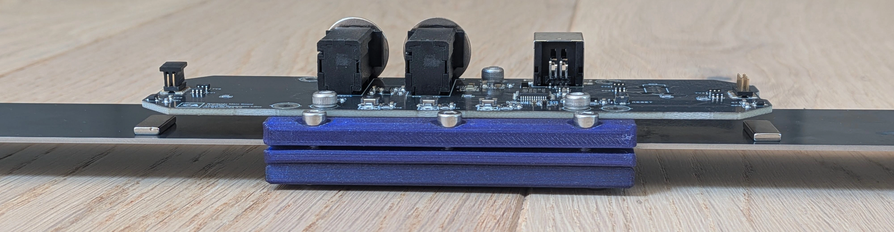

🇬🇧 [English](README.md) | 🇫🇷 [Français](README.fr.md) | 🇪🇸 **Español**

# Bandolibre

Un controlador MIDI de código abierto que trae el bandoneón comunmente utilizado en Argentina a la era digital.

**Bandolibre tiene un único objetivo:** convertir las pulsaciones de teclas y el movimiento del fuelle en señal MIDI — con fidelidad, sin latencia y sin el costo ni el ruido de un instrumento acústico. Conéctalo a cualquier computadora, tableta o teléfono por USB y estará listo para tocar, componer o practicar.

Una iniciativa abierta de [L'Atelier du bandonéon libre](https://github.com/bandolibre)

---

## Escúchalo

Mira las demos: [con un clarinete virtual](https://youtu.be/6s1wlRKlAk4) · [con instrumentos virtuales de cuerda](https://youtu.be/nJ0j7DtbYDk).

---

## ¿Para quién es?

- **Estudiantes** que aún no tienen instrumento y quieren comenzar a aprender
- **Músicos** que quieren practicar en silencio — en casa, de viaje, a cualquier hora
- **Compositores** que ingresan partituras nota a nota en un software de notación
- **Músicos de escenario** que controlan sintetizadores y sampleadores en vivo o en estudio

---

## ¿Cómo funciona?

- **Teclado Rheinische Lage de 142 tonos** — ambas manos, digitación exacta del bandoneón tradicional en Argentina
- **Sensores de efecto Hall en cada tecla** — sin contacto mecánico, sin desgaste, 2400 lecturas por segundo
- **Lámina de resorte + sensor** para el fuelle — mide el esfuerzo de empuje y de tracción y emite MIDI CC#11 (Expresión), igual que el instrumento real
- **Dos entradas de pedal de expresión de 6,35 mm** — compatibles con M-Audio EX-P; pedal 1 envía CC#1 (Modulación), pedal 2 envía CC#4 (Controlador de pie)
- **USB-MIDI** de fábrica — conéctalo a cualquier DAW, software de notación o sintetizador; no necesita controladores

---

## Funcionalidades

**Modo mesa** — un botón activa el modo mesa: las teclas suenan inmediatamente a velocidad fija, sin necesidad de mover el fuelle. Ideal para ingresar una partitura nota a nota sin accionar el fuelle.

**Toca en cualquier lugar** — Bandolibre se alimenta por el bus USB; cualquier teléfono, tableta o laptop con un sintetizador por software se convierte en el motor de sonido. Un pequeño hub USB con salida de auriculares y paso de alimentación te da audio, carga y MIDI desde un solo cable — testeado y de bolsillo.

**Adaptable** — el estándar USB-MIDI es compatible con todo el ecosistema de adaptadores: conecta un adaptador USB Bluetooth MIDI para tocar de forma inalámbrica, o un adaptador USB a DIN-5 para controlar sintetizadores de hardware vintage.

---

## Cualquiera puede construirlo

Este es un proyecto DIY completamente abierto. Los PCB están diseñados para la fabricación "economic PCBA" JLCPCB de dos capas — accesibles y fáciles de pedir. Las piezas mecánicas son imprimibles en 3D (un FabLab cercano funciona de maravilla). El firmware es de código abierto y se puede flashear con una sonda [ST-LINK](https://www.st.com/en/development-tools/stlink-v3minie.html) estándar y un cable [TC-2070-IDC-050](https://www.tag-connect.com/product/tc2070-idc-050).

Construir un Bandolibre cuesta aproximadamente lo mismo que un buen teclado MIDI o un buen par de auriculares de estudio como el DT-770 Pro.

---

## Lista de materiales

| Pieza | Cant. | Notas |
|-------|-------|-------|
| Piezas impresas en 3D + 71 teclas | — | ~880 g de filamento, ~24 h de impresión, [archivos STEP](https://github.com/bandolibre/bandolibre.github.io/releases)|
| Placas electrónicas: principal, izquierda y derecha | 1 | [Diseño EasyEDA](boards), [archivos Gerber](https://github.com/bandolibre/bandolibre.github.io/releases) |
| Interruptores de efecto Hall | 71 | [GATERON Low Profile Magnetic Jade HE](https://www.gateron.com/products/gateron-low-profile-magnetic-jade-switch?VariantsId=10872) |
| Lámina resorte para fuelle | 1 | [Acero para resorte 65Mn, 1,2 × 40 × 300 mm](https://fr.aliexpress.com/item/1005006952720032.html?spm=a2g0o.order_list.order_list_main.17.3cfd1802U67eT2&gatewayAdapt=glo2fra) |
| Imanes permanentes 14,5 × 6 × 2 mm | 2 | |
| Tornillo allen M4 × 30, acero inox A2 | 4 | [proveedor](https://www.vis-express.fr/vis-metaux-inox-a2-chc-btr-cle-de-8-hc8-filetage-total-din-912-din-912-iso-4762/36756-927484-vis-metaux-inox-a2-chc-btr-cle-de-3-hc3-m4x40-filetee-sur-22.html#/267-conditionnement-200_pieces)|
| Arandela plana M4 × 10 × 0,8, acero inox A2 | 4 | [proveedor](https://www.vis-express.fr/rondelle-plate-m-inox-a2-nfe-25513vs-nfe25513-grade-c/36925-940576-rondelle-plate-m4x10x08-m-inox-a2.html#/267-conditionnement-200_pieces)|
| Tornillo allen M3 × 6, acero inox A2 | 19 | [proveedor](https://www.vis-express.fr/vis-metaux-inox-a2-chc-btr-cle-de-8-hc8-filetage-total-din-912-din-912-iso-4762/36726-2595617-vis-metaux-inox-a2-chc-btr-cle-de-25-hc25-m3x6-filetage-total.html#/21-conditionnement-1_piece)|
| Tornillo allen M3 × 8, acero inox A2 | 11 | [proveedor](https://www.vis-express.fr/vis-metaux-inox-a2-chc-btr-cle-de-8-hc8-filetage-total-din-912-din-912-iso-4762/36728-2610009-vis-metaux-inox-a2-chc-btr-cle-de-25-hc25-m3x8-filetage-total.html#/21-conditionnement-1_piece) |
| Tornillo allen M3 × 12, acero inox A2 | 4 | [proveedor](https://www.vis-express.fr/vis-metaux-inox-a2-chc-btr-cle-de-8-hc8-filetage-total-din-912-din-912-iso-4762/36731-2616466-vis-metaux-inox-a2-chc-btr-cle-de-25-hc25-m3x12-filetage-total.html#/21-conditionnement-1_piece) |
| Tornillo allen M3 × 18, acero inox A2 | 4 | [proveedor](https://www.vis-express.fr/vis-metaux-inox-a2-chc-btr-cle-de-8-hc8-filetage-total-din-912-din-912-iso-4762/36734-2596394-vis-metaux-inox-a2-chc-btr-cle-de-25-hc25-m3x18-filetage-total.html#/21-conditionnement-1_piece) |
| Adhesivos | 2 gotas | Loctite 480 |
| Cable USB Type-B | 1 | |
| Cable plano, FC 1.27 mm, 12P (2×6), 10 cm | 2 | [proveedor](https://fr.aliexpress.com/item/1005005058041580.html) |

La lista completa, incluidas herramientas y consumibles, está en [`documentation/assembly_instructions.md`](documentation/assembly_instructions.md).

Lo ideal es construirlos por lotes de cinco — los pedidos mínimos de JLCPCB hacen de esta la cantidad mas conveniente. Únete a amigos o contacta a [L'Atelier du bandonéon libre](https://github.com/bandolibre) para expresar interés en una construcción colectiva.

A partir de cincuenta unidades, la fabricación de PCB y los interruptores Gateron — las dos partidas más importantes — el costo baja a la mitad nuevamente.

---

## Diseño

Las piezas mecánicas están modeladas en Onshape — [el modelo 3D completo](https://cad.onshape.com/documents/313e70e978bf056a8dd7d76c/v/5c5fbc4088ac379c1bd1b53a/e/c6a89cb028bdc195ff70596f?showReturnToWorkspaceLink=tru) es público e interactivo. Se utilizó [fotografía de referencia](keyboard_picture/) de instrumentos reales para reproducir con precisión la forma, la disposición de teclas y la inclinación del teclado de ambas manos.

Los PCB están diseñados con EasyEDA.

El fuelle es reemplazado por una **lámina de resorte equipada con dos sensores de efecto Hall** que leen su flexión. Las soluciones basadas en celdas de carga fueron descartadas — demasiado rígidas, eliminan el feedback táctil que los bandoneonistas necesitan para sentir y modular su esfuerzo — es como presionar contra una pared. La lámina resorte preserva ese feedback propioceptivo siendo a la vez simple y duradera. El grosor de la lámina puede elegirse para ajustar la rigidez del instrumento, de suave a firme.

Un botón selector de sensibilidad permite selectionar entre tres niveles de amplificación para ajustar cuánto recorrido de fuelle se necesita para alcanzar la máxima expresión — útil para tocar suave.

Para un desglose detallado del comportamiento del firmware y los controles, ver [`documentation/features.md`](documentation/features.md).

---

## Construcción

- **Hardware y ensamblado:** ver [`documentation/assembly_instructions.md`](documentation/assembly_instructions.md)
- **Firmware:** ver [`code/`](code/) — compilar con `just build` y `just flash` para flashear via ST-LINK

---

## El sonido

Lo que mejor funciona hasta ahora son los instrumentos de simulación de la familia **SWAM** de [Audio Modeling](https://audiomodeling.com/): están basados en modelado físico en lugar de muestras, así que el CC#11 controla el modelo mismo de forma continua. La intensidad del fuelle se traduce en matices reales — el timbre cambia con la presión, las notas crecen y se apagan bajo el fuelle — en vez de un simple desvanecimiento de volumen sobre una muestra fija. [Native Instruments Session Strings](https://www.native-instruments.com/en/products/komplete/cinematic/session-strings-2) también da muy buenos resultados.

Curiosamente, las bibliotecas modernas de bandoneón nos funcionan mal. O bien suponen una disposición de teclado equivocada — mapeos cromáticos o de acordeón, sin distinción entre empuje y tracción — o bien ofrecen un soporte superficial del CC#11, con los matices fijados en muestras disparadas por velocidad que el fuelle ya no puede remodelar una vez iniciada la nota.

Para practicar — y sobre todo en el teléfono — basta con un simple soundfont de bandoneón: [European Bandoneon V2.5 de Jörg Bleymehl](https://musical-artifacts.com/artifacts/1862) da buenos resultados. Se carga en cualquier reproductor compatible con SF2, casi no consume CPU, y convierte un teléfono o una tableta en un instrumento de práctica utilizable, sin computadora ni anfitrión de plugins.

Por eso estamos buscando activamente instrumentos virtuales con soporte expresivo profundo — rica polifonía y CC#11 como controlador principal de articulación. Si conoces alguno, o quieres ayudar a construir algo hecho a medida para el bandoneón, las sugerencias y contribuciones son mas que bienvenidas.

---

## ¿Cómo queda?

  
  

Cinco unidades fueron construidas y están funcionando. El firmware maneja las 142 teclas, el fuelle empuje/tracción, los pedales y la salida MIDI de forma confiable. Estos cinco instrumentos están actualmente prestados a profesores de bandoneón que nos dan retroalimentación práctica mientras pulimos el software.

Los modelos 3D y los diseños de PCB son sólidos — no hay revisiones planificadas. El foco esta puesto ahora en afinar la simulación del fuelle: lograr que el modelo de inercia haga que las notas cortas se sientan como en el instrumento real, no como un sensor.

Hay mucho por explorar respecto del software. Dado que los sensores de efecto Hall miden la posición de las teclas de forma continua — no solo encendido/apagado — el firmware tiene acceso al recorrido completo de cada tecla en todo momento. Esto abre la puerta al **MPE (MIDI Polyphonic Expression)**: curvas de presión, deslizamiento y levantamiento por nota, de forma independiente para cada una de las 142 teclas simultáneamente.

---

## ¿Cómo obtener un dispositivo?

Bandolibre sigue siendo un proyecto DIY: los planos son abiertos y cualquiera puede construir uno. Estamos puliendo el software y recopilando comentarios sobre el hardware.

Lo que falta es el marco administrativo que le permita a la asociación concretar una transacción — ceder placas, un kit o un instrumento terminado a quien lo pida.

Si quieres que te avisemos cuando sea posible:

### ✉️ **[Únete a la lista de espera →](https://forms.gle/amgxEX4XTy9Jfd538)**

También nos ayuda a ver cuánta gente está interesada y para qué lo tocarían. Tus respuestas quedan en la asociación y solo se usan para contactarte a propósito de Bandolibre.

---

## Comunidad

¿Preguntas, ideas, o simplemente tienes curiosidad?
Únete a [L'Atelier du bandonéon libre](https://bandolibre.github.io).

La placa principal se comunica digitalmente con las placas wing y puede soportar cualquier disposición. Es posible diseñar un nuevo teclado para un sistema diferente — Rheinische Lage, Club, Einheitsbandoneon, Peguri, Manouri — y reutilizar la placa principal.

¿Estás trabajando en algo similar? Cuéntale a la asociación — nos encantaría conectar.

---

## Lecturas adicionales

- [Otros proyectos de bandoneón electrónico](documentation/other-projects.md)

---

## Licencia

Libre de construir, modificar y compartir para uso no comercial.
